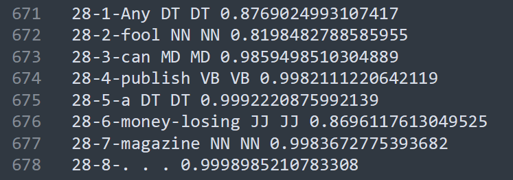

:warning: (Documentation in progress!) :warning:

Beamsearch for Maxent POS Tagging
---

This script reads a MaxEnt model file produced by the [MALLET](http://mallet.cs.umass.edu/) ML toolkit and uses an implementation of the beamsearch algorithm to find the most probable tag sequence for the text.

### About the code

The format for launching the script is:  

```beamsearch_maxent.py test_data boundary_file model_file sys_output beam_size topN topK```

where ```test_data``` is sec19_21.txt, ```boundary_file``` is sec19_21.boundary, ```model_file``` is m1.txt (in m1.rar), ```sys_output``` is the desired name of the output, ```beam_size``` is the max gap between the log probability of the best path and the log probability of a kept path, ```topN``` is the number of best POS tags for a word to use when expanding a tree node, and ```topK``` is the max number of paths kept alive at each position after pruning.

|  | 
|:--:| 
| *A sample of the output with the format of: (sentence# - word# - word) (gold POS label) (predicted label) (probability of tag given word).* |
