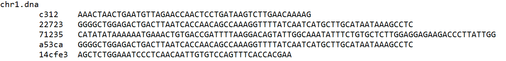

DNA Sequence Search Trie
---

Searches for DNA sequences in the human genome chromosome dataset produced by UCSC for [The UCSC genome browser](https://genome.ucsc.edu/).

### About the code
For this project, I produced a C++ program which searches for 4,965 target DNA sequences in a corpus of 24 files that map the chromosomes of the human genome. The program contains a TrieNode class which builds a trie structure from the list of target sequences and allows for relatively quick simultaneous searches of all target sequences in the large chromosome data files. 
Each node in the TrieNode class trie structure contains an array of five TrieNode child pointers corresponding to the five types of DNA input: 'A', 'C', 'G', 'T', and 'N'. The class uses a C++ switch statement as a simple hash function that returns the index number for child nodes in the trie structure. When traversing through the trie structure, the search function attempts to find the next node by calling the hash function to get the correct index, then, using that index number, directly accesses (O(1)) the current node’s child pointer using the subscript operator. If that pointer is set to null, the traversal ends and the node is checked for leaf status to determine whether or not a match has been found. Each node contains a Boolean value (is_leaf) that corresponds to its node status. This marker prevents the need to check all five of a nodes' child pointers for 'null' in order to determine whether a node is a terminal/leaf node in the trie. Results are output to the console (see Figure 1 for a sample) and also stored in a map, which is output to a second output file in a variant format.

A sampling of the output.

The full USCS genome dataset (778 MB) can be found [here](http://hgdownload.cse.ucsc.edu/goldenPath/hg19/bigZips/hg19.2bit).
