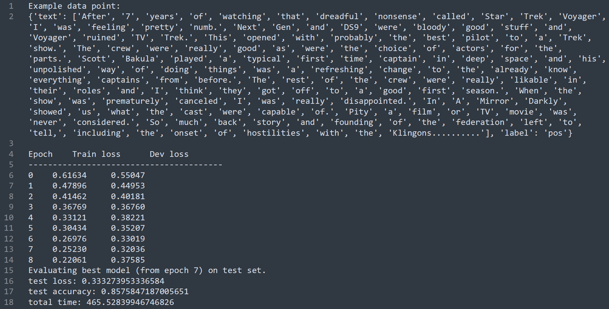

:warning: (Documentation in progress!):warning:

Deep Averaging Network
---

A Pytorch implementation of the Deep Averaging Network introduced in Iyyer et al (2015). Performs binary sentiment classification on the [IMDB reviews dataset](http://ai.stanford.edu/~amaas/data/sentiment/). 
 
### About the code

The format for launching the script is:  

```build_dt.py training_data test_data max_depth min_gain model_file sys_output```

where ```training_data``` is train.vectors.txt, ```test_data``` is test.vectors.txt, ```max_depth``` is the maximum depth of the tree, ```min_gain``` is the minimal information gain for each split, ```model_file``` is the filename for the output model, and ```sys_output``` is the classification results for the train and test data.

|  | 
|:--:| 
| *Results for --num epochs 12 --patience 3 --L2.* |


