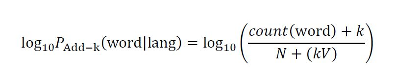
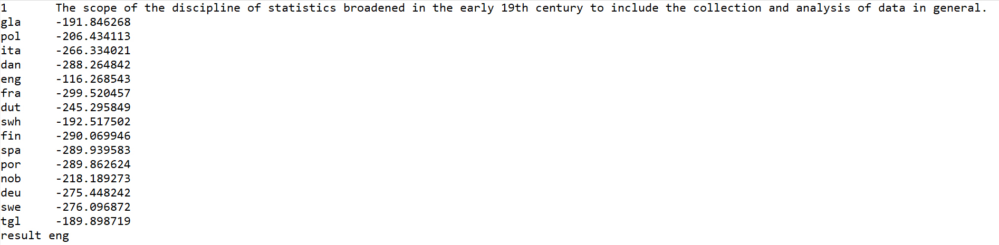

:warning: (Documentation in progress!):warning:

Naive Bayes Language Classifier
---

This project is a Python implementation of a naive Bayesian classifier that classifies fragments of text according to language category. The script builds a set of 15 unigram language models from a set of files containing token counts for 1,500 of the types in each language. The log probability of each sentence (given a language) is generated and output to the console (see image below). The most probable language is also output to the console and labeled as the “result".
To calculate the (smoothed) log probability of each word in the 15 language samples, the following formula was used:



### About the code

The format for launching the script is:  

```TODO```


|  | 
|:--:| 
| *Results for the first input sentence.* |


