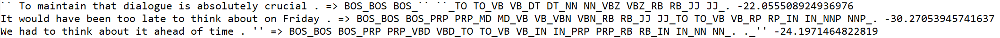

:warning: (Documentation in progress!):warning:

Viterbi Implementation for HMM POS Tagging
---

This script reads an HMM file produced by the [MALLET](http://mallet.cs.umass.edu/) machine learning toolkit along with a test data file, uses an implementation of the Viterbi algorithm to find the most probable tag sequence for the text, and then outputs the results to a file.

### About the code

The format for launching the script is:  

```viterbi.py input_hmm test_file output_file```

where ```input_hmm``` is hmm5, which can be found in hmm5.rar, ```test_file``` is test.word, and ```output_file``` is the desired name of the output file.

|  | 
|:--:| 
| *A sample of the output with the format of: (input) => (trigram POS label) (joint log probability of sequence).* |
